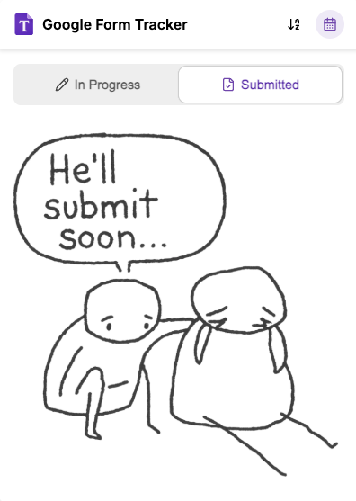

# Google Form Tracker

Chrome extension that allows you to save form responses before submission and keeps a history of both in-progress and submitted forms.

Try it yourself:
1. Clone this repository
2. Run `npm install` to install the dependencies
3. Run `npm run build` to build the extension
4. Load the extension in Chrome:
   1. Go to `chrome://extensions/`
   2. Turn on Developer mode
   3. Click "Load unpacked"
   4. Select the `dist/google-form-history/browser` folder
5. Visit a Google Form 
6. Click the extension icon to view your tracked forms
